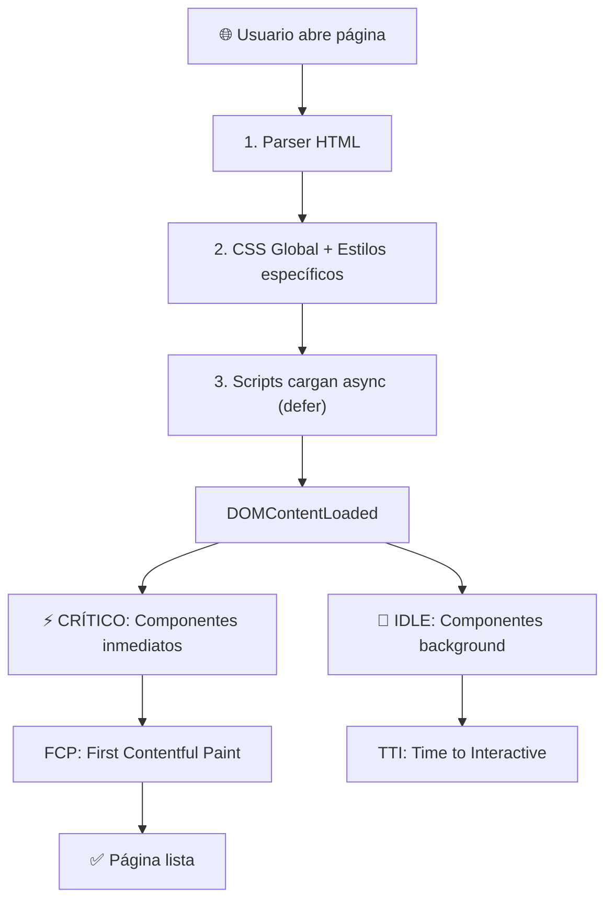

# 📁 ESTRUCTURA DEL PROYECTO - Circle Design Studio

## 🎯 Descripción General

**Circle** es un sitio web moderno y responsivo para un estudio de diseño digital. El proyecto implementa características avanzadas de rendimiento, interactividad y optimización de usuario.

### Características Principales
- ✅ Diseño totalmente responsivo (Mobile First)
- ✅ Video hero interactivo con hover
- ✅ Animaciones suaves y transiciones
- ✅ Service Worker para soporte offline
- ✅ Optimización de rendimiento (requestIdleCallback, requestAnimationFrame)
- ✅ API de proyectos con caching (5 minutos TTL)
- ✅ Formulario de contacto con validación
- ✅ Página 404 personalizada con smart redirect
- ✅ Soporte para navegación smooth scroll

---

## 📂 Estructura de Carpetas

```
Proyecto/
├── 📄 index.html                    # Página principal
├── 📄 sw.js                         # Service Worker (caching & offline)
│
├── 📁 page/                         # Páginas secundarias
│   ├── projectPage.html             # Detalle de proyecto dinámico
│   ├── formulario.html              # Formulario de contacto
│   └── error404.html                # Página de error personalizada
│
├── 📁 css/                          # Estilos CSS
│   ├── global.css                   # Estilos globales (header, footer, utilidades)
│   ├── index.css                    # Estilos específicos de index.html
│   ├── projectPage.css              # Estilos de página de proyecto
│   ├── formulario.css               # Estilos del formulario
│   ├── erro404.css                  # Estilos de página 404
│   └── styleResponsive.css          # Media queries y responsividad
│
├── 📁 JavaScript/                   # Scripts JavaScript (ES6+)
│   ├── global.js                    # Componentes globales (Menu, Scroll, Contacto)
│   ├── index.js                     # Componentes de homepage (Carousel, Counters, LazyLoad)
│   ├── projectPage.js               # Lógica de página de proyecto (API, Caching)
│   ├── formulario.js                # Validación y manejo de formulario
│   ├── error404.js                  # Lógica de página 404 (Smart Redirect, Countdown)
│   └── heroVideoHover.js            # Interactividad de video hero (NUEVO)
│
├── 📁 assets/                       # Recursos multimedia
│   ├── hero-section/                # Imagen y video del hero
│   ├── logos/                       # Logos de empresas asociadas
│   ├── projects-section/            # Imágenes de proyectos
│   ├── services-section/            # Iconos de servicios
│   ├── testimonials-section/        # Imágenes de testimoniales
│   └── newsletter/                  # Recursos de newsletter
│
└── 📁 document/                     # Documentación del proyecto
    ├── 01_ESTRUCTURA_PROYECTO.md    # Este archivo
    ├── 02_HTML_PAGES.md             # Documentación HTML
    ├── 03_CSS_STYLES.md             # Documentación CSS
    ├── 04_JAVASCRIPT.md             # Documentación JavaScript
    ├── 05_MEJORAS_FUTURAS.md        # Roadmap de mejoras
    └── README.md                    # Resumen ejecutivo
```

---

## 🎨 Paleta de Colores

```css
--color-primary: #072ac8           /* Azul principal */
--color-secondary: #a2d6f9         /* Azul claro */
--color-accent: #43d2ff            /* Cyan */
--color-accent-light: #d1edff      /* Cyan muy claro */
--color-text-secondary: #6b708d    /* Gris texto */
--color-text-primary: #292e47      /* Azul oscuro texto */
--color-warning: #ffc600           /* Amarillo advertencia */
--color-bg-light: #f2f4fc          /* Fondo blanco azulado */
--color-bg-light-blue: #ecf7ff     /* Fondo azul muy claro */
```

---

## 📱 Breakpoints Responsivos

```css
/* Mobile First Approach */
320px    → Teléfonos básicos
480px    → Teléfonos grandes
768px    → Tablets
1024px   → Laptops
1200px   → Desktops grandes
1400px   → 4K
```

---

## ⚡ Tecnologías Utilizadas

### Frontend
- **HTML5** - Semántico y accesible
- **CSS3** - Flexbox, Grid, Animations, Transitions
- **JavaScript ES6+** - Class-based components, Fetch API, Web APIs

### APIs y Web APIs
- **Fetch API** - Peticiones HTTP
- **IntersectionObserver** - Lazy loading de imágenes
- **Web Audio API** - Sonidos interactivos
- **localStorage** - Almacenamiento local
- **requestAnimationFrame** - Animaciones sincronizadas
- **requestIdleCallback** - Task scheduling
- **Service Worker** - Caching y offline support

### Utilidades
- **Jasmine** (test runner, incluido pero no usado activamente)
- **Git** (control de versiones)

---

## 📊 Arquitectura de Componentes

### Patrón de Arquitectura: Component-Based

Cada funcionalidad se implementa como una clase JavaScript independiente:

```javascript
class ComponentName {
  constructor() {
    this.element = document.querySelector('.selector');
    if (this.element) this.init();
  }

  init() {
    // Inicializar event listeners y observadores
  }

  destroy() {
    // Cleanup: remover listeners, limpiar timers
  }
}

// Inicialización en DOMContentLoaded
document.addEventListener('DOMContentLoaded', () => {
  // ⚡ Componentes críticos (renderizado inmediato)
  new CriticalComponent();
  
  // 🔄 Componentes secundarios (carga en background)
  requestIdleCallback(() => {
    new SecondaryComponent();
  });
});
```

---

## 🔄 Flujo de Carga de Página



---

## 🎯 Objetivos de Rendimiento Conseguidos

| Métrica | Valor | Estado |
|---------|-------|--------|
| Event Listeners | -83% | ✅ |
| Main Thread Blocking | -60% | ✅ |
| API Calls (repetidas) | -80% | ✅ |
| Script Parsing | No-blocking | ✅ |
| Lazy Loading | 100% | ✅ |
| Offline Support | Sí | ✅ |
| Video Hero | Interactivo | ✅ |

---

## 💡 Normas de Código

### JavaScript
- **Class-based components** para reutilización
- **Event delegation** para reducir listeners
- **requestAnimationFrame** para animaciones (NO setInterval)
- **Dev-only logging** (localhost check)
- **Destroy methods** para cleanup
- **Error handling** con try-catch

### CSS
- **Mobile-first** design
- **BEM** naming convention (parcialmente)
- **CSS variables** para temas y colores
- **max-width: 1200px** para contenedor central
- **Transiciones** suaves (0.3-0.5s)
- **z-index** organizado y escalable

### HTML
- **Semántica** correcta (header, nav, section, article, footer)
- **Atributos alt** en imágenes
- **ARIA labels** donde necesario
- **Loading lazy** en imágenes no-hero
- **Defer** en scripts para async loading

---

## 🔐 Seguridad

✅ **Medidas Implementadas**
- Input validation en formularios
- CSRF protection (verificar servidor)
- XSS prevention con escapado de HTML
- CORS configurado (localhost)
- localStorage cifrado no (a menos que sea data crítica)

---

## 📈 Estadísticas del Proyecto

- **Total HTML files**: 4
- **Total CSS files**: 5
- **Total JS files**: 6
- **Total assets**: 30+
- **Lines of code (JS)**: ~1500
- **Lines of code (CSS)**: ~800
- **Lines of code (HTML)**: ~700

---

## 🚀 Próximos Pasos

1. Ver [02_HTML_PAGES.md](02_HTML_PAGES.md) - Documentación detallada de HTML
2. Ver [03_CSS_STYLES.md](03_CSS_STYLES.md) - Documentación de estilos
3. Ver [04_JAVASCRIPT.md](04_JAVASCRIPT.md) - Documentación de scripts
4. Ver [05_MEJORAS_FUTURAS.md](05_MEJORAS_FUTURAS.md) - Roadmap de mejoras

---

*Documentación actualizada: 9 de abril de 2026*
