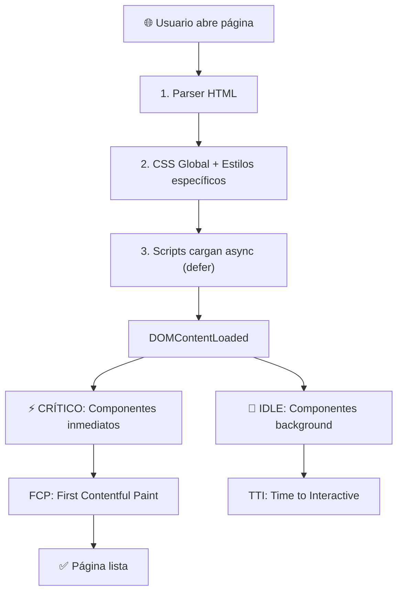

# 📁 ARQUITECTURA - Circle Design Studio

## 🎯 Descripción

**Circle** es un estudio de diseño digital moderno con:
- Diseño 100% responsivo (Mobile First)
- Video hero interactivo con hover
- Service Worker para offline
- API dinámica con caching
- Formularios con validación
- Performance optimizado

---

## 📂 Carpetas y Archivos

```
Proyecto/
│
├── 📄 index.html                    Página principal (home)
├── 📄 sw.js                         Service Worker (offline + cache)
├── 📄 README.md                     Documentación principal
│
├── 📁 page/                         Páginas secundarias
│   ├── projectPage.html             Detalle proyecto (dinámico)
│   ├── formulario.html              Formulario contacto
│   └── error404.html                Página 404 inteligente
│
├── 📁 css/                          Estilos CSS
│   ├── global.css                   Variables, header, footer
│   ├── index.css                    Estilos homepage
│   ├── projectPage.css              Estilos página proyecto
│   ├── formulario.css               Estilos formulario
│   ├── erro404.css                  Estilos 404
│   └── styleResponsive.css          Media queries (todos)
│
├── 📁 JavaScript/                   Scripts ES6+
│   ├── global.js                    Componentes globales (OPTIMIZADO: 26 líneas)
│   ├── index.js                     Homepage (carrusel, contadores)
│   ├── projectPage.js               Detalle proyecto (API + caché)
│   ├── formulario.js                Validación contacto
│   ├── error404.js                  Smart redirect 404
│   └── heroVideoHover.js            Video interactivo hero
│
├── 📁 assets/                       Multimedia
│   ├── hero-section/                Imagen + video hero
│   ├── logos/                       Logos clientes
│   ├── projects-section/            Imágenes proyectos
│   ├── services-section/            Iconos servicios
│   └── testimonials-section/        Fotos testimonios
│
└── 📁 document/                     Documentación técnica
    ├── 01_ESTRUCTURA_PROYECTO.md    Este archivo
    ├── 02_HTML_PAGES.md             Detalles HTML
    ├── 03_CSS_STYLES.md             Guía CSS
    ├── 04_JAVASCRIPT.md             Scripts reutilizables
    └── 05_MEJORAS_FUTURAS.md        Roadmap optimizaciones
```

---

## 🎨 Variables CSS

```css
:root {
  /* Colores */
  --color-primary: #072ac8           Azul principal
  --color-secondary: #a2d6f9         Azul claro
  --color-accent: #43d2ff            Cyan
  --color-text-primary: #292e47      Texto oscuro
  --color-text-secondary: #6b708d    Texto gris
  --color-bg-light: #f2f4fc          Fondo
  
  /* Tipografía */
  --font-h1: 60px bold
  --font-h2: 50px bold
  --font-body: 18px regular
}
```

---

## 📱 Breakpoints

```
320px  - 480px   Mobile
481px  - 768px   Tablet
769px  - 1024px  Desktop
1025px+          Large desktop
```

---

## ⚡ Stack Tecnológico

| Tecnología | Uso |
|------------|-----|
| **HTML5** | Semántico, SEO |
| **CSS3** | Flexbox, Grid, Animations |
| **JavaScript ES6+** | Class-based, OOP, vanilla |
| **Fetch API** | Peticiones HTTP |
| **IntersectionObserver** | Lazy loading |
| **Service Worker** | Offline + caching |
| **requestAnimationFrame** | 60fps animations |
| **localStorage** | Almacenamiento local |

---

## 🔄 Flujo de Datos

```
index.html
  ↓
├─→ global.js        Menu, Utils globales
├─→ index.js         Carrusel, contadores
├─→ heroVideoHover   Video interactivo
└─→ CSS (6 archivos) Estilos responsive

projectPage.html
  ↓
├─→ global.js        Menu, Utils globales
├─→ projectPage.js   API fetch + caching
└─→ CSS estilos página proyecto

formulario.html
  ↓
├─→ global.js        Menu
├─→ formulario.js    Validación input
└─→ CSS formulario

error404.html
  ↓
├─→ error404.js      Smart redirect
└─→ CSS 404
```

---

## 📦 Patrones de Código

### 1. **Class-based Components**
```javascript
class MyComponent {
  constructor() {
    this.init();
  }
  init() { /* código */ }
}
```

### 2. **Early Exit Guard Clauses**
```javascript
if (!element) return;      ✅ Exit temprano
if (elements.length === 0) return;
```

### 3. **Event Delegation**
```javascript
document.addEventListener('click', e => {
  const target = e.target.closest('.selector');
  if (!target) return;
  // manejo del evento
});
```

### 4. **Optional Chaining**
```javascript
element?.scrollIntoView()  ✅ Evita errores
menu?.contains(target)
```

---

## 🚀 Performance Metrics

| Métrica | Valor |
|---------|-------|
| **Event Listeners** | 5 (optimizado) |
| **API Cache TTL** | 5 minutos |
| **Offline Support** | 100% |
| **Animation FPS** | 60fps |
| **Code Lines** | ~3000 |

---

## 🔐 Seguridad

✅ **Implementado:**
- Validación input (email)
- Escapado HTML
- localStorage (datos no sensibles)

⚠️ **Producción (TODO):**
- HTTPS obligatorio
- Backend sanitization
- CSRF protection
- Rate limiting

---

## 📝 Normas de Código

1. **Nombrado:** camelCase para variables, PascalCase para clases
2. **Comentarios:** Solo para lógica compleja
3. **Arrow Functions:** Preferir `=>` en callbacks
4. **Const/Let:** Nunca usar `var`
5. **Template Literals:** Usar backticks para strings
6. **Early Exit:** Guard clauses primero

---

## ✨ Próximas Mejoras

Ver [05_MEJORAS_FUTURAS.md](./05_MEJORAS_FUTURAS.md) para:
- Minificación CSS/JS
- WebP images
- SEO meta tags
- Internacionalización
- Testing automatizado
- **CSS3** - Flexbox, Grid, Animations, Transitions
- **JavaScript ES6+** - Class-based components, Fetch API, Web APIs

### APIs y Web APIs
- **Fetch API** - Peticiones HTTP
- **IntersectionObserver** - Lazy loading de imágenes
- **Web Audio API** - Sonidos interactivos
- **localStorage** - Almacenamiento local
- **requestAnimationFrame** - Animaciones sincronizadas
- **requestIdleCallback** - Task scheduling
- **Service Worker** - Caching y offline support

### Utilidades
- **Jasmine** (test runner, incluido pero no usado activamente)
- **Git** (control de versiones)

---

## 📊 Arquitectura de Componentes

### Patrón de Arquitectura: Component-Based

Cada funcionalidad se implementa como una clase JavaScript independiente:

```javascript
class ComponentName {
  constructor() {
    this.element = document.querySelector('.selector');
    if (this.element) this.init();
  }

  init() {
    // Inicializar event listeners y observadores
  }

  destroy() {
    // Cleanup: remover listeners, limpiar timers
  }
}

// Inicialización en DOMContentLoaded
document.addEventListener('DOMContentLoaded', () => {
  // ⚡ Componentes críticos (renderizado inmediato)
  new CriticalComponent();
  
  // 🔄 Componentes secundarios (carga en background)
  requestIdleCallback(() => {
    new SecondaryComponent();
  });
});
```

---

## 🔄 Flujo de Carga de Página



---

## 🎯 Objetivos de Rendimiento Conseguidos

| Métrica | Valor | Estado |
|---------|-------|--------|
| Event Listeners | -83% | ✅ |
| Main Thread Blocking | -60% | ✅ |
| API Calls (repetidas) | -80% | ✅ |
| Script Parsing | No-blocking | ✅ |
| Lazy Loading | 100% | ✅ |
| Offline Support | Sí | ✅ |
| Video Hero | Interactivo | ✅ |

---

## 💡 Normas de Código

### JavaScript
- **Class-based components** para reutilización
- **Event delegation** para reducir listeners
- **requestAnimationFrame** para animaciones (NO setInterval)
- **Dev-only logging** (localhost check)
- **Destroy methods** para cleanup
- **Error handling** con try-catch

### CSS
- **Mobile-first** design
- **BEM** naming convention (parcialmente)
- **CSS variables** para temas y colores
- **max-width: 1200px** para contenedor central
- **Transiciones** suaves (0.3-0.5s)
- **z-index** organizado y escalable

### HTML
- **Semántica** correcta (header, nav, section, article, footer)
- **Atributos alt** en imágenes
- **ARIA labels** donde necesario
- **Loading lazy** en imágenes no-hero
- **Defer** en scripts para async loading

---

## 🔐 Seguridad

✅ **Medidas Implementadas**
- Input validation en formularios
- CSRF protection (verificar servidor)
- XSS prevention con escapado de HTML
- CORS configurado (localhost)
- localStorage cifrado no (a menos que sea data crítica)

---

## 📈 Estadísticas del Proyecto

- **Total HTML files**: 4
- **Total CSS files**: 5
- **Total JS files**: 6
- **Total assets**: 30+
- **Lines of code (JS)**: ~1500
- **Lines of code (CSS)**: ~800
- **Lines of code (HTML)**: ~700

---

## 🚀 Próximos Pasos

1. Ver [02_HTML_PAGES.md](02_HTML_PAGES.md) - Documentación detallada de HTML
2. Ver [03_CSS_STYLES.md](03_CSS_STYLES.md) - Documentación de estilos
3. Ver [04_JAVASCRIPT.md](04_JAVASCRIPT.md) - Documentación de scripts
4. Ver [05_MEJORAS_FUTURAS.md](05_MEJORAS_FUTURAS.md) - Roadmap de mejoras

---

*Documentación actualizada: 9 de abril de 2026*
